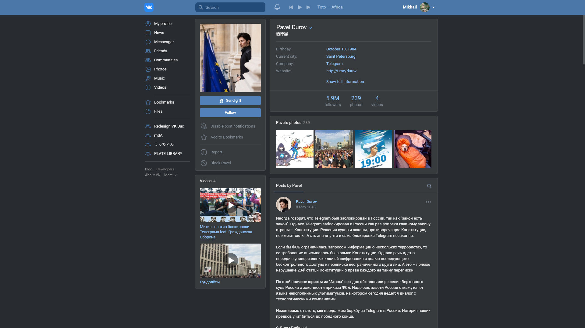

	
	 
	<h3 align="center">
		Проект заморожен в связи с релизом официальной темной темы
	</h1>
	<h1 align="center">
		VK Dark Theme
	</h1>
	

		
	

	

		Темная тема для <a href="https://www.vk.com">VK.com</a>, с возможностью кастомизации
	

	

## Превью

## Установка

Вам понадобиться установить расширение [Stylus](https://add0n.com/stylus.html) для своего браузера ([Chrome](https://chrome.google.com/webstore/detail/stylus/clngdbkpkpeebahjckkjfobafhncgmne), [Firefox](https://addons.mozilla.org/firefox/addon/styl-us/), [Opera](https://addons.opera.com/extensions/details/stylus/), [GitHub](https://github.com/openstyles/stylus/))

Затем нажмите на ссылку ниже:

## Ссылки

* [Группа Вконтакте](https://add0n.com/stylus.html)
* [Страница разработки](https://evoll.notion.site/535759f7c1c244719e942dc274b05143?v=b18f4ddb94f845c8829d9e751a840d3c)
